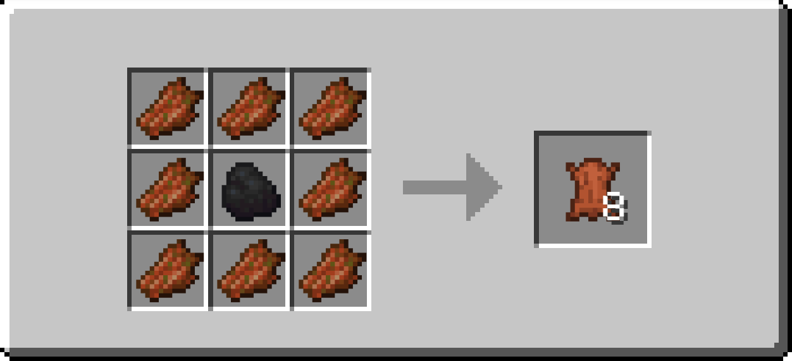
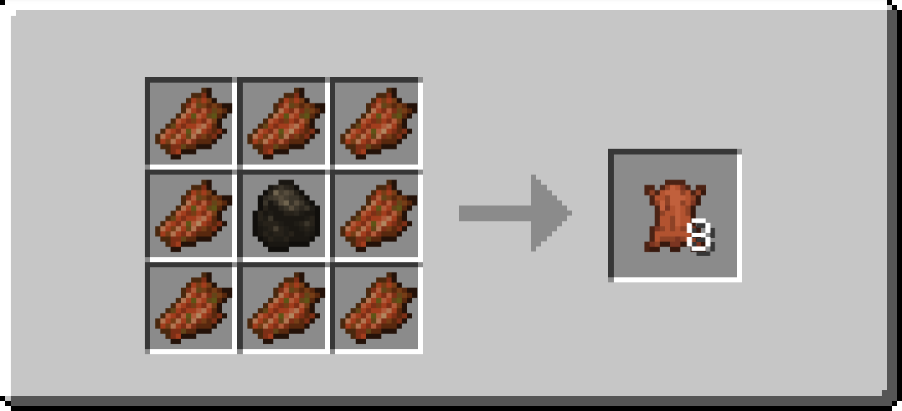
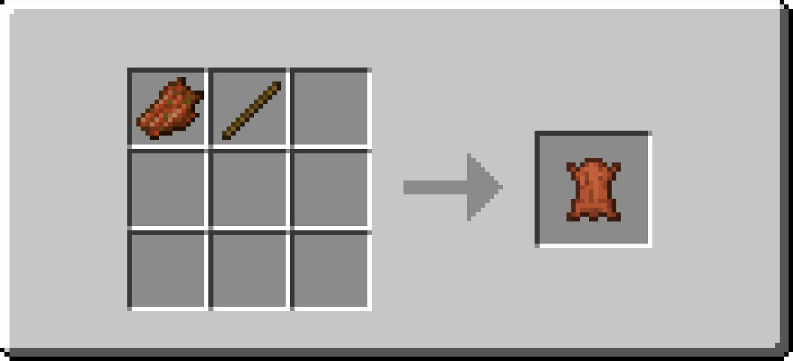

# Zombie Leather

A Minecraft datapack that adds multiple ways to convert rotten flesh into leather, making those zombie drops actually useful.

## Features

This datapack adds six different recipes to transform rotten flesh into leather:

### Cooking Methods

| Method            | XP  | Description                                            |
|-------------------|:---:|--------------------------------------------------------|
| **Furnace**       | 0.2 | Smelt rotten flesh into leather.                       |
| **Smoker**        | 0.2 | Cook rotten flesh into leather. (faster than furnace)  |
| **Blast Furnace** | 0.2 | Blast rotten flesh into leather. (faster than furnace) |
| **Campfire**      | 0.2 | Cook rotten flesh over a campfire into leather.        |

### Crafting Methods
- **Shaped Recipes**: Surround 1 coal/charcoal with 8 rotten flesh → 8 leather

- **Shapeless Recipe**: Combine 1 rotten flesh + 1 stick → 1 leather

## Compatibility

- **Pack Format**: 88
- **Minecraft Version**: 1.21.4+

## Installation

1. Download the datapack (or clone this repository)
2. Locate your Minecraft world's save folder:
   - **Windows**: `%appdata%\.minecraft\saves\[Your World Name]\datapacks`
   - **macOS**: `~/Library/Application Support/minecraft/saves/[Your World Name]/datapacks`
   - **Linux**: `~/.minecraft/saves/[Your World Name]/datapacks`
3. Place the `zombie-leather` folder into the `datapacks` directory
4. Launch Minecraft and load your world
5. Verify installation by running `/datapack list` in-game - you should see `[file/zombie-leather]` in the enabled list

## Usage

Once installed, you can start converting rotten flesh to leather immediately! Choose your preferred method:

- Drop rotten flesh into any furnace-type block for automatic conversion
- Use the crafting recipes for bulk conversion or emergency crafting

## Why Use This Datapack?

Rotten flesh is one of the most abundant but least useful items in Minecraft. This datapack gives it practical value by allowing you to convert it into leather, which is always needed for books, item frames, armor, and more!

## Acknowledgments

Recipes generated using [Misode's Recipe Generator](https://misode.github.io/recipe/) - a fantastic free tool for creating Minecraft datapack recipes.

## License

Feel free to use and modify this datapack for your personal use or servers.
